# Agentic Systems — Tool Use, Orchestration, MCP

## 1. What makes something an "agent"

A plain LLM call: `prompt → completion`, one shot, no interaction with the
world. An **agent** adds a loop: the model can decide to call **tools**
(functions/APIs), observe the result, and decide again — repeating until
it produces a final answer. The defining property is **the model controls
control flow**, not a fixed script.

Minimum ingredients: LLM + tool definitions + an execution loop + (usually)
memory/state.

## 2. Function/tool calling mechanics

- You give the model a list of tool schemas (name, description, JSON-schema
  args) alongside the prompt.
- Model outputs a structured tool-call request (name + args) instead of
  free text when it decides a tool is needed.
- Your code executes the actual function/API call, feeds the result back
  into the conversation as a new message, and calls the model again.
- Model can chain multiple tool calls before producing a final answer.

This is the mechanism that makes **RAG-as-a-tool**, **MCP**, and
**multi-agent hand-off** all work — they're all "tool calling" at
different granularities.

## 3. ReAct: the base reasoning pattern

**Re**ason + **Act**, interleaved:

```
Thought: I need the customer's order status to answer this.
Action: call get_order_status(order_id=123)
Observation: {"status": "shipped", "eta": "2026-08-03"}
Thought: I have what I need.
Final Answer: Your order shipped and should arrive Aug 3.
```

The model narrates reasoning between tool calls, which (a) improves
accuracy by forcing explicit intermediate steps, (b) gives you an audit
trail for debugging/observability.

Other planning patterns worth knowing:

- **Plan-and-Execute**: model writes a full multi-step plan up front, then
  executes each step (vs. ReAct's step-by-step improvisation). More
  predictable, less adaptive to surprises mid-execution.
- **Reflection / self-critique**: after producing an answer or plan, the
  model (or a second call) critiques it and revises — improves quality at
  the cost of latency/tokens.
- **Tree of Thought**: explore multiple reasoning branches, prune bad ones
  — expensive, used for hard reasoning tasks, rarely needed for typical
  enterprise agent tasks.

## 4. Single agent vs multi-agent — when to split

Default to **one well-prompted agent with good tools** first. Split into
multiple agents only when you hit a real limit:

- Context window pressure (one agent's job needs too much context to hold
  at once)
- Distinct specialized skill sets that benefit from separate system
  prompts/tools (e.g. a SQL-writing specialist vs a customer-tone
  specialist)
- Need for parallelism (independent sub-tasks that can run concurrently)
- Reliability via separation of concerns (a "critic" agent checking a
  "worker" agent's output)

When to stay single-agent

    Tasks that fit comfortably within one context window with room to spare
    Workflows where the steps are tightly interdependent and parallelism provides no benefit
    Prototyping or early development phases where simplicity matters more than scale
    Cases where the orchestration overhead would exceed the performance benefit

Cost of splitting: more latency (extra LLM round-trips), more orchestration
complexity, harder to debug, more tokens burned on inter-agent
coordination. **This tradeoff is a strong interview signal** — don't
default to multi-agent just because it sounds sophisticated.

## 5. Multi-agent orchestration patterns

_(sources: [LangChain — multi-agent](https://docs.langchain.com/oss/python/langchain/multi-agent),
[Dassum — Multi-Agent AI Patterns for
Developers](https://dassum.medium.com/multi-agent-ai-patterns-for-developers-pick-the-right-pattern-for-the-right-problem-8f03ef476b45))_

A few of these (orchestrator-worker, router, handoff, parallel fan-out) are
the same shapes named again from a routing-mechanics angle in §6's table —
and reflection / planning+execution get a deeper treatment in §3. Listed
together here as the full pattern catalog to pick from.

| Pattern                                           | Shape                                                                                                                         | Use case                                                                                                | Trade-off                                                                                                       |
| ------------------------------------------------- | ----------------------------------------------------------------------------------------------------------------------------- | ------------------------------------------------------------------------------------------------------- | --------------------------------------------------------------------------------------------------------------- |
| **Sequential / pipeline**                         | A → B → C, each hands off output to next                                                                                      | Well-defined multi-stage workflow (extract → transform → validate → summarize)                          | Clear traceability at every step; throughput capped by the slowest agent                                        |
| **Orchestrator-worker (hierarchical/supervisor)** | Orchestrator dynamically decomposes the task, delegates to specialists, monitors progress, aggregates results                 | Most common enterprise pattern — dynamic task dependencies, e.g. e-commerce order processing            | Handles runtime replanning well; orchestrator is a bottleneck and single point of failure (see §6)              |
| **Parallel fan-out / fan-in**                     | Independent sub-tasks dispatched concurrently, results merged                                                                 | All sub-tasks known upfront — competitive analysis, multi-source data collection                        | Latency ≈ slowest branch, not the sum; can't handle tasks with inter-dependencies                               |
| **Router / dispatch**                             | A lightweight classifier picks one specialist and exits                                                                       | Customer support ticket routing, multi-domain assistants, cost-tiering simple queries to cheaper models | Cheap and simple; only works when a single specialist can own the whole task — no decomposition                 |
| **Handoff**                                       | An agent recognizes it's out of scope and transfers the conversation, with full context, to a more capable agent or a human   | Escalation tiers (support, healthcare triage), human-in-the-loop workflows                              | Preserves context gracefully; needs carefully drawn scope boundaries or handoffs fire too early/late            |
| **Planning + execution**                          | Planner produces the full multi-step roadmap upfront; executor(s) carry it out; planner re-engages only to replan             | Complex multi-step research/analysis where upfront strategy pays off (see §3)                           | More predictable than step-by-step improvisation; overkill for small, fixed, well-known workflows               |
| **Reflection / self-critique**                    | A generator agent produces output, a critic reviews it, loop until a quality threshold is met                                 | Code generation with test cycles, content requiring iterative refinement (see §3)                       | Measurably improves quality; adds latency and token cost per iteration                                          |
| **Evaluator-optimizer loop**                      | Generate multiple candidates, score each against explicit criteria, feed scores back to generate improved candidates          | Prompt optimization, ad-copy testing, iterative code performance tuning                                 | Measurable improvement over iterations; expensive, and only as good as the scoring function                     |
| **Debate / adversarial**                          | Two or more agents argue opposing positions; a judge agent decides                                                            | High-stakes reasoning, fact verification where single-pass quality isn't enough                         | Surfaces disagreement explicitly; expensive, and only as reliable as the judge's calibration                    |
| **Network / swarm**                               | Agents hand off to each other directly, no fixed hierarchy                                                                    | Flexible, emergent workflows                                                                            | Harder to reason about/debug; higher risk of infinite handoff loops                                             |
| **Group chat**                                    | All agents share one conversation thread, each contributes when relevant                                                      | Brainstorming, multi-perspective drafting                                                               | Rich cross-pollination between agents; expensive (every agent reads every turn) and hard to control turn-taking |
| **Mixture of Agents (MoA)**                       | Multiple models generate diverse candidate responses in a layer; separate aggregator/refiner layers synthesize a final answer | Maximize accuracy when cost/latency isn't the binding constraint                                        | Highest accuracy ceiling of the group; multiplies token cost the most                                           |

### Pattern diagrams

Same order as the table above. Boxes are agents, diamonds are decision
points, dashed arrows are conditional/loop-back edges.

**Sequential / pipeline**

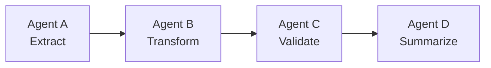

**Orchestrator-worker (hierarchical/supervisor)**

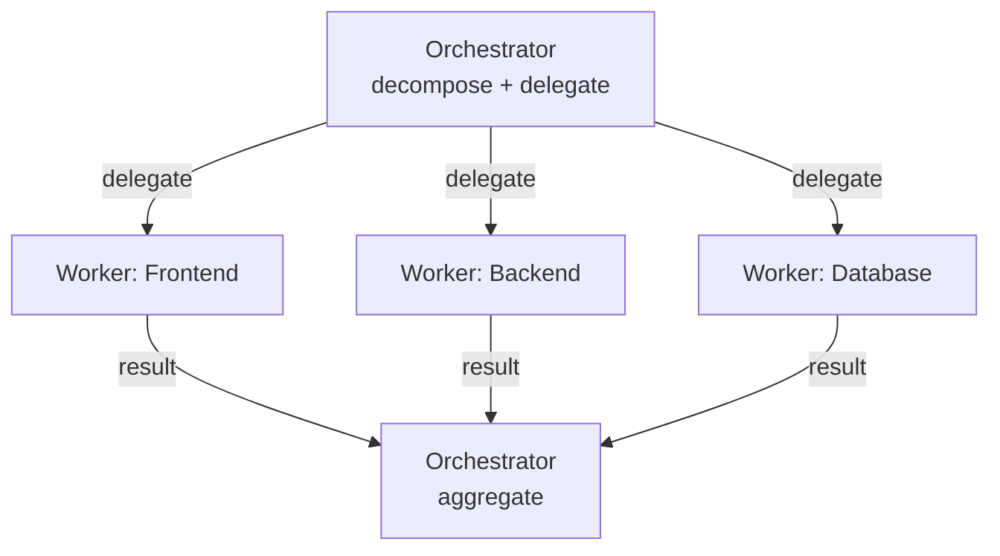

**Parallel fan-out / fan-in**

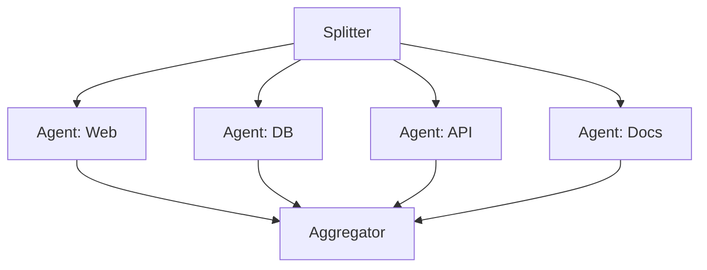

**Router / dispatch**

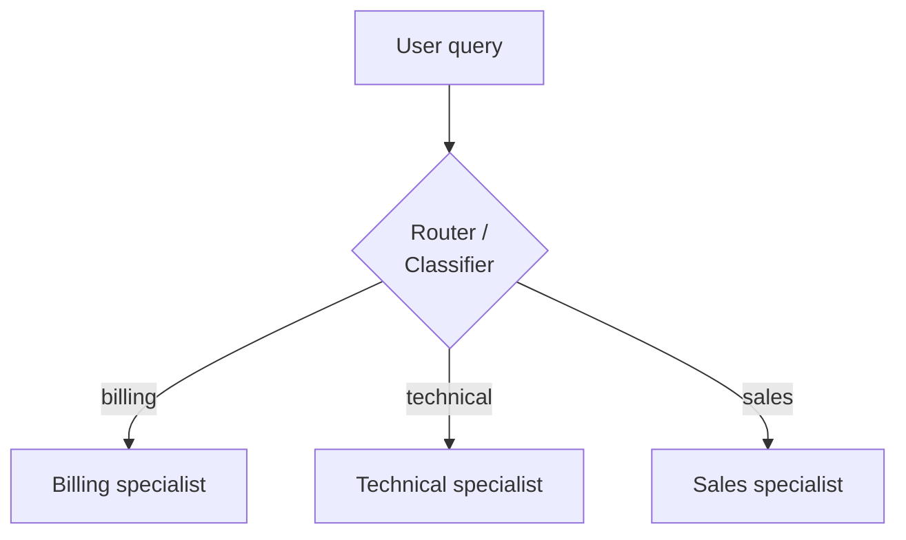

**Handoff**

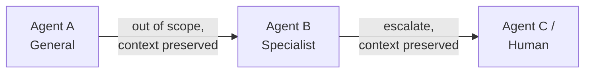

**Planning + execution**

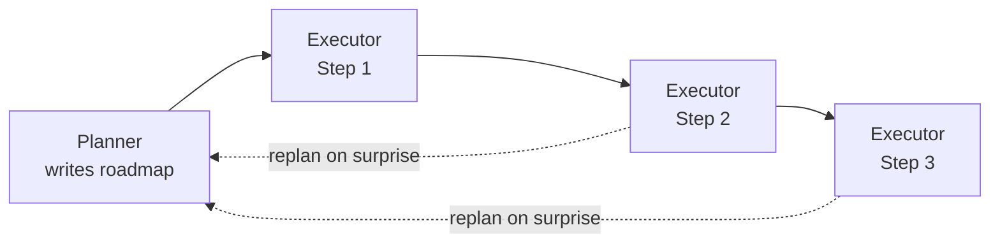

**Reflection / self-critique**

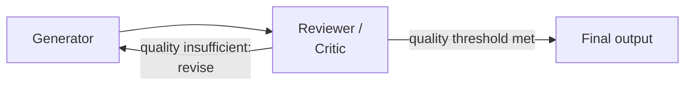

**Evaluator-optimizer loop**

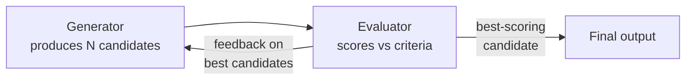

**Debate / adversarial**

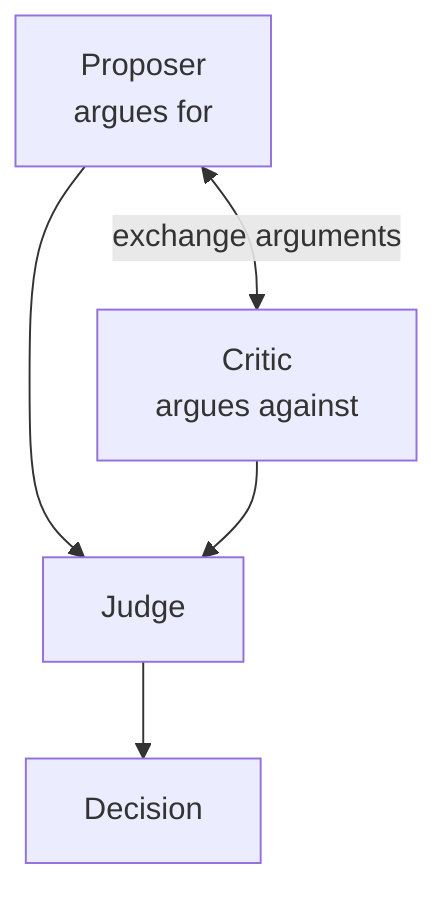

**Network / swarm**

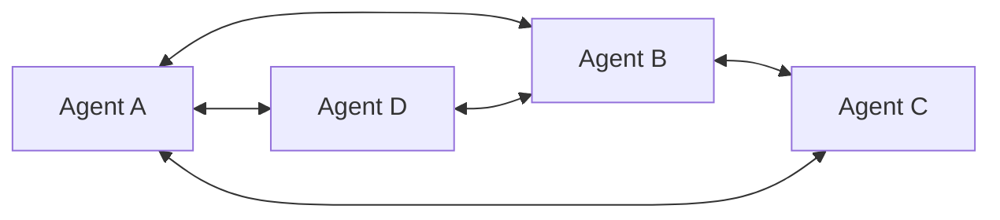

**Group chat**

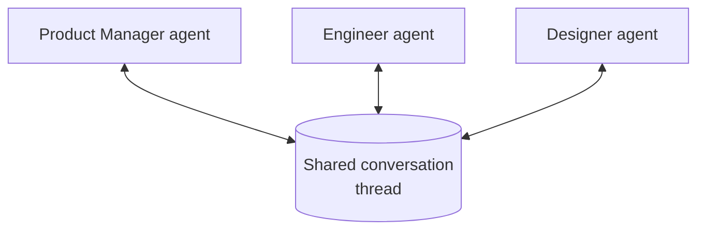

**Mixture of Agents (MoA)**

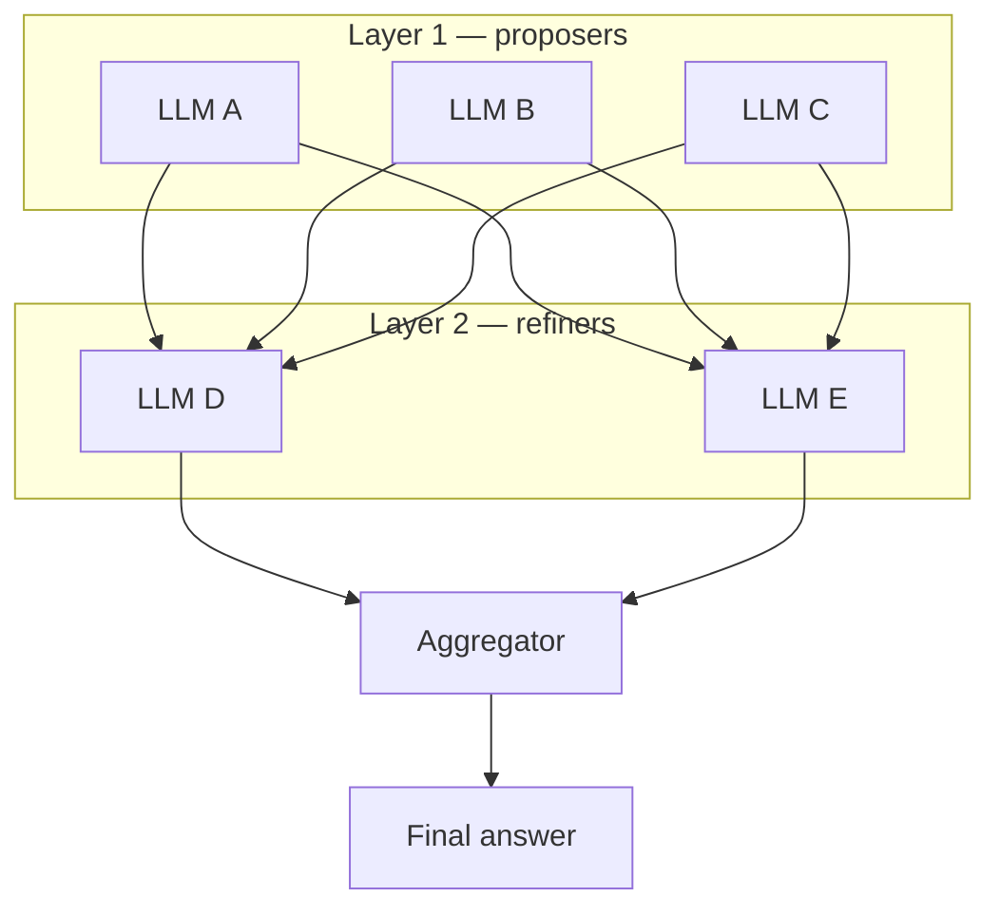

**Picking a pattern** — work down this list until one fits:

1. Does a single agent suffice? → stay single-agent (see §4).
2. Need domain specialization? → orchestrator-worker or router/dispatch.
3. Need raw speed on independent sub-tasks? → parallel fan-out/fan-in.
4. Need higher accuracy than one pass gives? → reflection, debate, or
   mixture-of-agents.
5. Need adaptability mid-task? → planning + execution.
6. Need graceful escalation? → handoff.

**Production systems combine patterns** rather than picking one in
isolation — e.g. router + reflection (route to a specialist, specialist
self-critiques its own output), orchestrator + parallel + reflection
(decompose, fan out concurrently, each worker self-critiques before
returning), or router + handoff + human-in-the-loop (classify, specialize,
escalate with context preserved). Start with the simplest single pattern
that fits and add a second only when a specific failure mode demands it —
this is the same "don't default to multi-agent" discipline from §4, applied
one level down to pattern choice itself.

### Mixed-pattern diagrams

**Router + reflection** — route to a specialist, specialist self-critiques
its own output before returning:

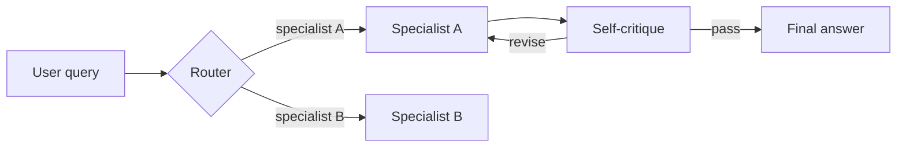

**Orchestrator + parallel + reflection** — decompose, fan out
concurrently, each worker self-critiques before returning to the
orchestrator for synthesis:

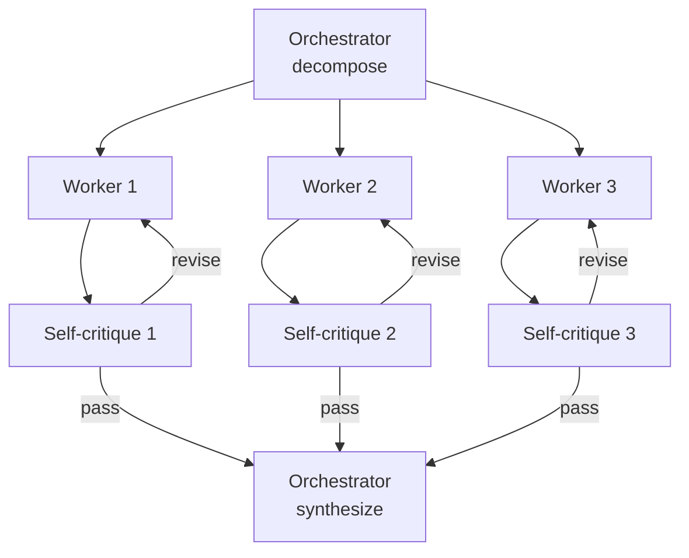

**Router + handoff + human-in-the-loop** — classify, specialize, escalate
to a human with full context preserved:

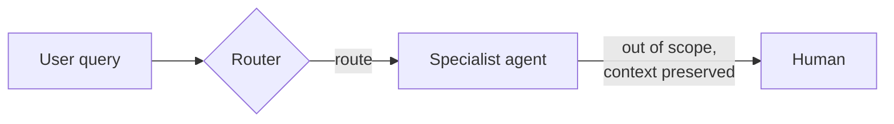

## 6. Anatomy of a multi-agent system & routing patterns

_(source: [AWS — Multi-Agent Architectures](https://aws.amazon.com/marketplace/build-learn/ai-agent-learning-series/multi-agent-architectures#anatomy-of-a-multi-agent-system--e6infr))_

### Four structural planes

Useful mental model for decomposing _any_ multi-agent system in a design
discussion — map the system onto these four planes before picking a
framework:

- **Control plane (orchestration)** — the orchestrator holds the
  high-level task understanding, decomposes goals into subtasks, assigns
  work, monitors progress, and synthesizes results. Critically, **the
  orchestrator doesn't perform the work itself — it directs**. Keeping
  that separation clean is what makes the system debuggable.
- **Execution plane (specialized agents)** — each agent has a narrowly
  scoped responsibility, a domain-tailored system prompt, a curated set of
  MCP tools, and (if relevant) its own retrieval corpus. Agents can be
  deployed and evolved independently — this is the main advantage over a
  monolithic single agent.
- **State plane (shared memory)** — three distinct data categories, each
  wanting a different store:
  - _Task state_ — durable tracking of requests/completions/remaining
    work (e.g. DynamoDB).
  - _Session context_ — short-lived conversation history and
    intermediate results (e.g. ElastiCache/Redis).
  - _Domain knowledge_ — read-only retrieval layer for facts/specs (e.g.
    a RAG knowledge base).
- **Capability plane (tools and MCP)** — MCP servers expose standardized,
  discoverable tool interfaces shared across the execution plane, so
  capability isn't duplicated per agent and updates propagate to every
  consumer.

### Routing patterns — how work actually gets dispatched

These are the mechanics underneath "supervisor/worker" and "network" above
— i.e., _how_ the orchestrator (or router) decides where a piece of work
goes:

| Routing pattern                  | Mechanics                                                                                                                             | Strength                                                                                                              | Weakness / risk                                                     |
| -------------------------------- | ------------------------------------------------------------------------------------------------------------------------------------- | --------------------------------------------------------------------------------------------------------------------- | ------------------------------------------------------------------- |
| **Centralized orchestration**    | A lead agent decomposes the task and delegates to subagents while holding full task context throughout                                | Supports dynamic decisions and real-time adaptation (e.g. Amazon Bedrock Multi-Agent Collaboration's supervisor mode) | Orchestrator is a single point of failure and reasoning bottleneck  |
| **Skill-based dispatch**         | An agent picks from a fixed catalog of pre-built, parameterized "skills," each a well-defined operation executing a specific workflow | Excels with a stable, known set of operations                                                                         | Struggles with open-ended or improvised tasks outside the catalog   |
| **Handoff chains**               | Sequential agent-to-agent transfer — each agent processes the predecessor's output and passes enriched results forward                | Maps naturally onto pipeline architectures (e.g. AWS Step Functions state machines)                                   | Inflexible — can't easily branch based on intermediate results      |
| **Parallel fan-out & synthesis** | A router dispatches the _same_ task to multiple specialists simultaneously; a synthesizer collects and unifies their outputs          | Fast multi-domain evaluation (e.g. security + ops + cost review in parallel)                                          | Needs a real conflict-resolution strategy when specialists disagree |

Interview framing: pick the routing pattern from the _shape of the
decision_, not habit — "does the next step depend on this step's result?"
(handoff chain), "do I need N independent opinions on the same input?"
(fan-out/synthesis), "is this one of a small fixed set of known
operations?" (skill-based dispatch), "does one brain need to hold the
whole plan?" (centralized orchestration).

## 7. Frameworks (know the mental model, not every API)

- **LangGraph**: models the agent as a **state graph** — nodes are
  functions (often LLM calls or tool calls), edges define transitions,
  including **conditional edges** for branching logic. Ships built-in
  **checkpointing** (persist state at each node, resume later) and
  **human-in-the-loop** interrupts (pause graph execution for approval).
  Good mental model: an explicit, inspectable state machine instead of a
  hidden agent loop — this is why it fits production systems that need
  auditability.
- **CrewAI**: models agents as a **crew** of role-based agents (each with a
  role, goal, backstory) executing a set of **tasks**, with a **process**
  mode of `sequential` or `hierarchical` (manager agent delegates).
  Higher-level/opinionated than LangGraph — faster to prototype
  role-based workflows, less low-level control.
- **Google ADK (Agent Development Kit)**: Google's framework for building
  agents that deploy natively on Vertex AI; first-class support for
  multi-agent hierarchies, tool integration (including MCP), and
  evaluation. Relevant because it's the JD's named preferred framework and
  is Vertex-AI-native (tight fit with GCP deployment story).

Interview framing: you don't need to write LangGraph code from memory, but
you should be able to say _"I'd model this as a state graph with a router
node and two specialist nodes, checkpointed so it can resume after a human
approval step"_ — i.e., use the vocabulary correctly.

## 8. MCP — Model Context Protocol

Split out into its own file: **[02a-mcp.md](./02a-mcp.md)** — host/server
model, why it beats bespoke per-integration glue code, and multi-agent
auth/authorization on shared MCP servers.

## 9. A2A — Agent-to-Agent protocol

MCP standardizes agent → tool/data. **A2A standardizes agent → agent**
communication, and is a fundamentally different shape: **peer-to-peer,
not client-server**.

- **Task objects, not function calls**: the unit A2A passes between
  agents is a rich task object, not a thin RPC call — it carries the
  task description, prior work done by other agents, authorized
  resources, the expected output format/schema, and applicable
  constraints. Example: an orchestrator delegating a deployment step
  sends a task object containing "the service manifest produced by the
  analysis agent, the deployment target constraints approved by the user,
  the IaC pattern preference, and a structured output schema" — far more
  context than a bare function call could carry, which is why A2A fits
  delegation better than MCP does.
- **Agent cards (discoverability)**: agents publish a "card" at a known
  endpoint advertising what they accept (task types, input/output
  schemas), what they require (auth requirements, rate limits), and their
  processing constraints. This is what enables a **loosely coupled agent
  ecosystem** — a new agent built by a different team can be added to an
  orchestrated workflow "immediately, without changes to the
  orchestrator's code," because the orchestrator discovers its contract
  from the card instead of hardcoding it.
- **A2A security — an expanded attack surface**: because agents accept
  rich task objects from _other agents_ (not just from a trusted
  orchestrator calling a tool), a receiving agent must:
  - Validate the task object against its schema before processing it.
  - Apply content filtering to task descriptions and context fields (they
    may embed injected instructions).
  - Enforce its own access controls regardless of what the task object
    _claims_ the sender is authorized to do — never trust a claim of
    authorization carried inside the payload itself.
  - Guardrail layers (e.g. Amazon Bedrock Guardrails) can be applied at
    the agent boundary to filter both incoming task objects and outgoing
    responses.

**MCP vs A2A, one line each**: MCP = how an agent calls a tool/data
source. A2A = how one agent delegates rich, contextual work to another
agent as a peer. A supervisor/worker system typically uses both — MCP
inside each agent for its tools, A2A between the orchestrator and its
subagents (or between subagents in a network/swarm topology).

## 10. Memory & state management

_(source: [LangChain — Memory](https://docs.langchain.com/oss/python/concepts/memory))_

Agent memory splits along one axis first — **scope** (how long it lives,
what it's shared across) — then long-term memory splits again by **content
type**. Interviewers probe this because "just add memory" is meaningless
without saying which kind and where it's written from.

### Short-term memory (thread-scoped)

- Lives inside a single conversation/session — conversation history,
  uploaded files, retrieved documents, generated artifacts — and is part of
  the agent's **state**, not a side store.
- In LangGraph terms: persisted via a **checkpointer** keyed by thread ID,
  which is what makes it resumable across turns within that thread (and
  the same mechanism that enables crash-recovery and human-in-the-loop
  interrupts — see framework note in §7). State is read at the start of
  each step and updated when the graph is invoked or a step completes —
  i.e. it's plain read/write state, not a separately-fetched memory.
- Bounded by the context window, so long-running threads need active
  management:
  - **Trim** — drop oldest messages once a token/turn budget is hit.
  - **Summarize** — periodically collapse older history into a running
    summary, keep only recent turns verbatim.
  - **Delete** — explicitly remove stale or irrelevant messages (e.g. a
    large tool result no longer needed) rather than letting it ride along.

### Long-term memory (cross-thread)

- Persists **across sessions**, addressed by a **namespace** (e.g. scoped
  per user or per org) plus a key — conceptually a document store, not the
  raw conversation.
- Retrieved like RAG: pulled in at the start of (or during) a new thread
  based on relevance to the current task, not replayed wholesale.

Designing long-term memory for a system comes down to two questions:
**what type of memory** (semantic/episodic/procedural — below), and **when
do you write it** (hot path vs. background — next subsection). Answering
both concretely is the difference between "we have memory" and an actual
design.

Three content types, each answering a different question:

| Type           | Answers                    | Typical shape                                                                                                                                  | Example                                                                    |
| -------------- | -------------------------- | ---------------------------------------------------------------------------------------------------------------------------------------------- | -------------------------------------------------------------------------- |
| **Semantic**   | "What do I know?"          | **Profile** (one continuously-updated document) or **collection** (documents appended over time)                                               | User's name, team, timezone, product preferences                           |
| **Episodic**   | "What have I done before?" | In practice implemented as **few-shot example prompting** — past input/trajectory/outcome triples injected into the prompt                     | A past support ticket resolved a similar way, replayed as an example       |
| **Procedural** | "How should I behave?"     | Technically model weights + agent code + prompt combined; in practice almost always just the **prompt**, updated via reflection/meta-prompting | "Always confirm before deleting a resource" learned from a past correction |

- **Profile vs. collection** (semantic memory's two storage patterns): a
  profile is a single struct kept current (overwrite in place — good for
  "the current facts about this user"); a collection is append-only (good
  for "everything we've learned," where old entries stay valid and new
  ones accumulate rather than overwrite).

### Writing memories: hot path vs. background

How a memory gets created is a design decision with a real latency/quality
tradeoff, not an implementation detail:

- **Hot path** — the agent decides to save a memory as part of the live
  turn (e.g. calls a `save_memory` tool before responding). Pro: happens in
  real time, visible/transparent to the user in the same turn. Con: adds
  latency to the response, and forces the model to split attention between
  "answer the user" and "decide what's worth remembering" in one pass —
  can degrade both.
- **Background** — a separate process (often after the turn, or on a
  schedule) reviews the conversation and extracts/updates memories
  asynchronously. Pro: zero added latency on the user-facing turn, cleanly
  decouples memory logic from response logic. Con: introduces a staleness
  window (memory isn't available until the background pass runs), and
  needs its own trigger policy (every turn? every N turns? end of session?).

### Memory storage: namespace + key

LangGraph's long-term memory `store` persists memories as JSON documents
addressed by a **namespace** (like a folder — e.g. `(user_id,
application_context)`) plus a distinct **key** (like a filename) within it.
Namespacing by user/org ID is what gives you hierarchical organization for
free. The store supports both **semantic search** (embedding similarity)
and **filtering by content** (exact field match) within and across
namespaces, so retrieval isn't limited to "fetch by exact key."

### Session vs. global state

Separate what's scoped to one conversation/task from what should
persist/be shared across users or sessions (e.g. a durable learned
preference vs. a one-off fact needed only for this task) — this is the
practical decision that determines whether something belongs in
short-term or long-term memory in the first place.

### GCP service mapping

Concrete answer for "where does this actually live on GCP" (see also file
05 §1):

- **Long-term memory** → **Memory Bank** (part of Vertex AI Agent Engine) —
  purpose-built for cross-session agent memory: namespace-addressed,
  supports semantic/episodic/procedural content, retrieved like RAG.
- **Short-term memory / session state** → no single default; pick based on
  requirements:
  - **Memorystore for Redis** — lowest latency, in-memory; best when hot
    session state (current turn's working set) is on the critical path and
    durability across restarts isn't required.
  - **Firestore** — durable document store; best when session state must
    survive process restarts or needs easy per-user/per-session querying,
    at a small latency cost vs. Redis.
  - **Gemini Enterprise Agent Platform Sessions** — managed session state
    built into the platform; best when the agent is already built on
    Gemini Enterprise Agent Platform and you'd rather not stand up/operate
    a separate state store.

## 11. Failure modes specific to agents

| Failure                          | Cause                                                            | Mitigation                                                                                                |
| -------------------------------- | ---------------------------------------------------------------- | --------------------------------------------------------------------------------------------------------- |
| Infinite/runaway loop            | Agent keeps calling tools without converging                     | Max-iteration caps, loop detection, cost/step budgets                                                     |
| Wrong tool selected              | Ambiguous tool descriptions, too many similar tools              | Tighter tool descriptions, tool routing/grouping, fewer tools per agent                                   |
| Tool arg hallucination           | Model invents plausible-looking but wrong args                   | Strict JSON-schema validation, reject and re-prompt on invalid args                                       |
| Context window overflow          | Long tool outputs or long histories                              | Summarize tool outputs, truncate history, hierarchical memory                                             |
| Cost explosion                   | Unbounded multi-agent chatter or retries                         | Token/cost budgets per request, circuit breakers                                                          |
| Silent partial failure           | One sub-agent fails, orchestrator proceeds anyway                | Explicit error propagation, supervisor checks sub-agent status before aggregating                         |
| Prompt injection via tool output | Malicious content in retrieved doc/API response steers the agent | Treat tool output as untrusted data, not instructions; sanitize/sandbox; least-privilege tool permissions |

## 12. Failure modes specific to _multi_-agent systems

Splitting one agent into several doesn't just add the failures above per
agent — it introduces new failure classes at the _boundaries between_
agents. These are the ones worth naming explicitly in a design interview:

| Failure                                    | Cause                                                                                                                                | Mitigation                                                                                                                                                                                                                                                  |
| ------------------------------------------ | ------------------------------------------------------------------------------------------------------------------------------------ | ----------------------------------------------------------------------------------------------------------------------------------------------------------------------------------------------------------------------------------------------------------- |
| Cascading failure                          | One agent's failure propagates downstream until the whole workflow collapses                                                         | Circuit breakers that detect repeated failures and route work away, so the system degrades instead of collapsing (e.g. Step Functions catch/retry); durable workflow engines (e.g. Temporal) resume from the failure point instead of re-running everything |
| Orchestration loop (runaway delegation)    | Validation fails → orchestrator asks for a revision → still fails → repeat, with unbounded cost                                      | Explicit loop detection with a max delegation count per task, forcing termination or human escalation; hard execution-time/step limits                                                                                                                      |
| Conflicting outputs from parallel agents   | Fan-out/synthesis specialists reach opposite conclusions (e.g. security says block, ops says ship)                                   | Domain-appropriate resolution policy decided up front — conservative bias (any concern surfaces) for safety-critical domains, relevance-weighting for operational ones                                                                                      |
| Context corruption at handoffs             | Malformed/truncated/semantically-inconsistent payload from a serialization bug or schema mismatch                                    | Schema validation at _every_ handoff boundary; return a structured error and halt rather than silently proceeding on corrupt data                                                                                                                           |
| Non-determinism propagation                | Per-agent error compounds across the pipeline — four agents at 90% accuracy each ≈ 66% end-to-end correctness                        | Individual agent quality must be well above the acceptable _system-level_ error rate; full end-to-end evaluation is non-optional, not a nice-to-have                                                                                                        |
| Low-confidence output passed downstream    | An uncertain agent still emits a confident-looking answer, and the next agent trusts it                                              | Structured/schema-validated outputs with a confidence score; agents should be able to **abstain** and escalate instead of guessing                                                                                                                          |
| Over-privileged sub-agents                 | A sub-agent is handed the orchestrator's full credentials "for convenience"                                                          | Least-privilege, time-limited, task-scoped credentials generated per delegation (e.g. IAM Roles Anywhere / STS), never the parent's full grant                                                                                                              |
| Prompt injection propagating across agents | Content from an external source (a repo, an upload, a third-party API) carries an injection that a later agent in the chain executes | Treat _all_ externally-originated content as untrusted from the moment it enters the system, not just at the first agent that touches it; filter/sanitize before it enters any handoff payload                                                              |

The through-line: **every agent boundary is also a trust boundary and a
validation boundary.** If you can't name what's validated/authorized at a
given handoff, that's the gap an interviewer will probe.

Also worth naming: **observability across agents is harder than within
one.** A single trace ID needs to propagate through every agent and tool
call so failures can be correlated across boundaries (distributed tracing
— e.g. CloudWatch/X-Ray-style trace graphs, or LangSmith's hierarchical
multi-agent trace view). Evaluate at three layers: per-agent (isolated),
full end-to-end workflow (does the _system_ succeed), and a differential
pass correlating per-agent scores with system-level outcomes — a
locally-good agent whose errors always show up in bad end-to-end runs is
a real finding, not noise. See file 03 for the full picture.

---

## Could you explain/draw this cold?

- [ ] Draw the ReAct loop and narrate a concrete example
- [ ] Explain the tradeoff of splitting one agent into multiple, with a
      concrete scenario where it's worth it and one where it isn't
- [ ] Explain the supervisor/worker pattern and why it's the most common
      enterprise choice
- [ ] Distinguish router/dispatch, handoff, evaluator-optimizer, debate, and
      mixture-of-agents, and pick the right one for a given scenario (§5)
- [ ] Name the four planes of a multi-agent system (control, execution,
      state, capability) and what lives in each
- [ ] Pick the right routing pattern (centralized orchestration,
      skill-based dispatch, handoff chain, parallel fan-out/synthesis)
      for a given scenario and justify it
- [ ] Explain what A2A adds over MCP (task objects, agent cards) and when
      you'd reach for it (MCP itself: see
      [02a-mcp.md](./02a-mcp.md#could-you-explaindraw-this-cold))
- [ ] Explain checkpointing and why it matters for human-in-the-loop
      workflows
- [ ] Explain short-term vs. long-term memory and how checkpointer/thread
      ID relates to short-term memory specifically
- [ ] Name the three types of long-term memory (semantic, episodic,
      procedural) with an example of each, and the profile-vs-collection
      distinction within semantic memory
- [ ] Argue hot-path vs. background memory writing for a given scenario
      (latency-sensitive vs. not) and name the tradeoff each side makes
- [ ] Name the GCP service for long-term memory (Memory Bank) and the three
      common short-term/state-management options (Memorystore for Redis,
      Firestore, Gemini Enterprise Agent Platform Sessions), and justify a
      pick among the three
- [ ] List 3 agent-specific failure modes and their mitigations
- [ ] List 3 multi-agent-specific (cross-boundary) failure modes and
      their mitigations, including the compounding-error-rate math
- [ ] Explain why tool output should be treated as untrusted input

--

## Further research
